# Advanced Image/Video Loading Nodes for ComfyUI

Advanced image and video loading nodes for ComfyUI with comprehensive animation support, batch
processing, and flexible frame selection capabilities.

This package was created to fill in the gaps of other image/video loading nodes, especially in
regards to animation support and frame selection.

## Features

- **Animation Support**: Load animated GIFs, video files (MP4, AVI, MOV, MKV) with frame extraction
- **Advanced Frame Selection**: Powerful syntax for selecting specific frames using ranges, steps, and negative indexing
- **Batch Processing**: Load multiple files from directories with various sorting and filtering options
- **Aspect Ratio Handling**: Multiple methods for handling aspect ratio mismatches (crop, pad, stretch)
- **Alpha Channel Support**: Full transparency support with separate mask outputs
- **Audio Extraction**: Extract audio from video files alongside frame data

## Installation

1. Clone this repository into your ComfyUI custom_nodes directory:
```bash
cd ComfyUI/custom_nodes
git clone https://github.com/SineSwiper/ComfyUI-LoadAnim-Adv.git
```

2. Restart ComfyUI

**OR** just make use of ComfyUI Manager's Custom Nodes Manager to download and install this node pack.

## Nodes

### Image Loading Nodes

#### Load Image/Video

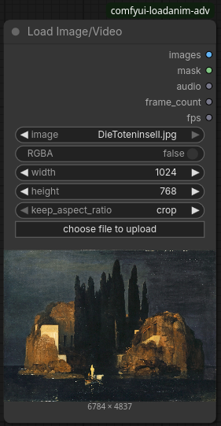

Load a single image or video file from the ComfyUI input directory with full animation support.

**Inputs**:
- `image`: Image/video file from input directory (with upload support)
- `RGBA`: Include alpha channel in image output (masks still include alpha channel)
- `width`/`height`: Target dimensions (0 = keep original)
- `keep_aspect_ratio`: How to handle aspect ratio mismatches, if not keeping the original (`crop`, `pad`, `stretch`)

**Outputs**:
- `images`: Image tensor (single image or animation frames)
- `mask`: Alpha channel/transparency mask
- `audio`: Extracted audio from videos
- `frame_count`: Total number of frames loaded
- `fps`: Frames per second from metadata

#### Load Image/Video From Path

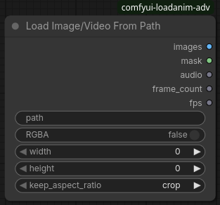

Load image or video from any filesystem path, with the same features as Load Image/Video.

**Inputs**:
- `path`: Absolute or relative file path
- (Others same as "Load Image/Video")

**Outputs**:
- (Same as "Load Image/Video")

#### Load Images/Videos From Directory

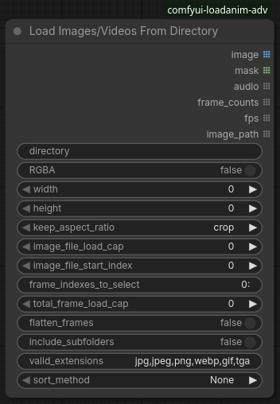

Load multiple images/videos from a directory with advanced batch processing capabilities.  The
`image_file_start_index` can be used in an incremental batch loop to process files sequentially.

**Inputs**:
- `directory`: Target directory path
- `RGBA`/`width`/`height`/`keep_aspect_ratio`: Same as "Load Image/Video" node
- `image_file_load_cap`: Maximum files to load (0 = no limit)
- `image_file_start_index`: Starting file index
- `frame_indexes_to_select`: Frame selection syntax (see Frame Selection Guide)
- `total_frame_load_cap`: Maximum total frames across all files
- `flatten_frames`: Combine all frames into single output
- `include_subfolders`: Search subdirectories recursively
- `valid_extensions`: Comma-separated file extensions
- `sort_method`: File sorting method

**Outputs**:
- `image`: List of image tensors
- `mask`: List of transparency masks
- `audio`: List of extracted audio
- `frame_counts`: List of frame counts per file
- `fps`: List of FPS values per file
- `image_path`: List of loaded file paths

### Selection and Processing Nodes

#### Select Indexes From Images

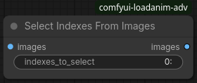

Select specific frames from image sets.

**Inputs**:
- `images`: Input image tensor
- `indexes_to_select`: Frame selection syntax (see "Frame Selection" below)

**Outputs**:
- `images`: Selected image frames

#### Select Indexes From Any

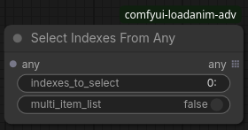

Generic selection node that works with any tensor or list type.

**Inputs**:
- `any`: Object set to select from (tensor or list)
- `indexes_to_select`: Frame/index selection syntax
- `multi_item_list`: Process as multi-item list vs individual items

**Outputs**:
- `any`: Selected subset of input data

#### Flatten Image List

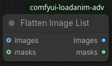

Combine multiple image sets into a single concatenated sequence.

**Inputs**:
- `images`: List of image tensors to combine
- `masks`: List of mask tensors to combine

**Outputs**:
- `images`: Combined image tensor sequence
- `masks`: Combined mask tensor sequence

### Utility Nodes

#### Basic Dimension Variables

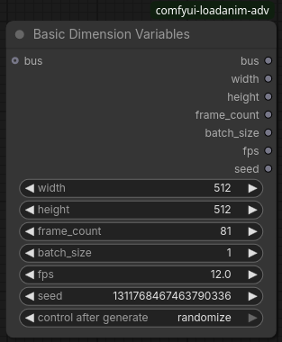

A common node for declaring basic image/video dimensions, to be propagated to other nodes.  By having
a single source for these values, you only have to change them once.  The "BDV Router" node can be used
to route these values to other sections of the workflow.

**Inputs**:
- `bus`: BDV bus input, from a previous BDV node.  If provided, will serve as an override for any zeroed inputs.
- `width`: Width of the image/video
- `height`: Height of the image/video
- `frame_count`: Frame length of the animation/video
- `batch_size`: Batch size
- `fps`: Frames per second
- `seed`: Random seed

**Outputs**:
- (Same as the inputs, for propagation)

#### BDV (Router)

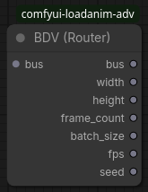

Takes a BDV bus of values and splits them up into their components, to be used in other nodes.

**Inputs**:
- `bus`: BDV bus input, from a previous BDV node output

**Outputs**:
- (Same as the original BDV node)

#### List Files From Directory

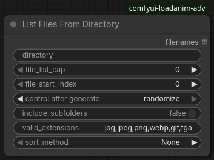

Generate file lists from directories with sorting and filtering.  Useful for further index processing
with batch loops.

**Inputs**:
- (Similar to "Load Images/Videos From Directory")

**Outputs**:
- `filenames`: List of matching file paths

#### Aggregate Number List

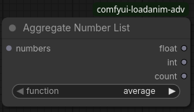

Aggregate numeric lists using various mathematical functions.  For example, this can be used to
average FPS values from multiple files.

**Inputs**:
- `numbers`: List of numbers to aggregate
- `function`: Aggregation method (`average`, `median`, `sum`, `prod`, `min`, `max`, `first`, `last`)

**Outputs**:
- `float`: Result as floating point number
- `int`: Result as integer
- `count`: Count of input numbers

#### Flatten Any List

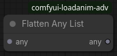

Generic list flattening for any data type.

**Inputs**:
- `any`: List of objects to flatten

**Outputs**:
- `any`: Flattened/concatenated result

## Frame Selection

The frame selection syntax uses Python's [range](https://docs.python.org/3/library/stdtypes.html#range)
function, each parameter divided by `:`.  Parameters can be omitted, and negative indices are supported.
The first frame is index 0.  Any range or item separated by commas is added to the selection.

### Basic Selection
- `0` - Select frame 0 (first frame)
- `1,3,5` - Select frames 1, 3, and 5
- `-1` - Select last frame
- `-3,-2,-1` - Select last 3 frames

### Range Selection
- `0:5` - Select frames 0 through 4
- `1:` - Select from frame 1 to end
- `:10` - Select first 10 frames
- `:-5` - Select all but last 5 frames

### Step Selection
- `::2` - Every 2nd frame (0, 2, 4, 6...)
- `1::3` - Every 3rd frame starting from 1 (1, 4, 7, 10...)
- `0:10:2` - Every 2nd frame in range 0-10 (0, 2, 4, 6, 8)

### Combined Selection
- `0,5:10,15,20:` - Mix single frames and ranges
- `0:5,10:15,::2` - Complex combinations

## Sorting Methods

Available sorting options for directory scanning:

- **None**: Original filesystem order
- **Alphabetical (ASC/DESC)**: Standard string sorting
- **Numerical (ASC/DESC)**: Natural number sorting (file1, file2, file10 vs file1, file10, file2)
- **Datetime (ASC/DESC)**: Sort by file modification time

## Aspect Ratio Handling

When resizing images to specific dimensions:

- **crop**: Center crop to exact dimensions (may lose image content)
- **pad**: Add padding to maintain aspect ratio (uses edge color detection)
- **stretch**: Stretch/squash image to fit exactly (may distort)
